# Recunoaștere de imagini: Imagebits și LandPatches

Acest proiect acoperă a doua temă de la Învățare Automată și tratează două probleme de clasificare a imaginilor, rezolvate cu același pipeline de bază: analiză exploratorie a datelor (EDA), augmentare, antrenare a unui ansamblu de modele MLP și CNN, apoi combinarea lor prin ensembling cu Test-Time Augmentation (TTA) și hard voting.

- **Capitolul 1** descrie setul de date **Imagebits** (10 clase de obiecte, imagini 96×96).
- **Capitolul 2** descrie setul de date **LandPatches** (10 clase de teren, imagini de satelit, 64×64).

Cele două seturi de date au pornit de la premise diferite: Imagebits venea cu un dezavantaj pentru modele: clasele nu erau balansate, iar LandPatches avea deja o împărțire train/val/test echilibrată. Asta a dus la decizii diferite de preprocesare, deși arhitecturile și logica de antrenare au rămas identice. Rezultatele complete se găsesc în `imagebits/results/ensemble_results_summary.csv` și `land_patches/results/land_patches_ensemble_results_summary.csv`; imaginile din acest README sunt doar o selecție reprezentativă din folderele `imagebits/results/` și `land_patches/results/`, unde se află toate graficele generate.

## Pipeline-ul general

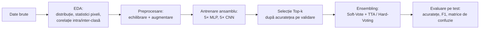

Ambele notebook-uri (`imagebits.ipynb`, `land_patches.ipynb`) sunt construite pe același schelet: o clasă de configurare cu hiperparametrii, funcții de EDA, două arhitecturi (`ImprovedMLP` și `CNN`), o buclă de antrenare cu early stopping, și un modul de ensembling cu patru variante de TTA (fără augmentare, flip orizontal, flip vertical, rotație 90°) plus hard voting.

---

## Capitolul 1: Imagebits

### Setul de date

10 clase de obiecte (avion, pasăre, mașină, pisică, cerb, câine, cal, maimuță, navă, camion), imagini RGB de 96×96 pixeli. Problema inițială: setul de antrenare avea prea puține exemple per clasă comparativ cu testarea, ceea ce a motivat generarea de date sintetice.

Distribuția e echilibrată per clasă (aproximativ 800 de imagini fiecare), dar volumul total rămâne mic pentru o rețea antrenată de la zero.

### Analiza exploratorie

Statisticile de pixeli per clasă arată medii între ~90 și ~135 și deviații standard de 60-76, semn că iluminarea și conținutul variază mult chiar în interiorul aceleiași clase. Distribuțiile de culoare RGB confirmă acest lucru: aproape toate clasele au histograme multimodale, adică imaginile conțin regiuni cu niveluri de culoare diferite (zone luminoase, umbre, fundal).

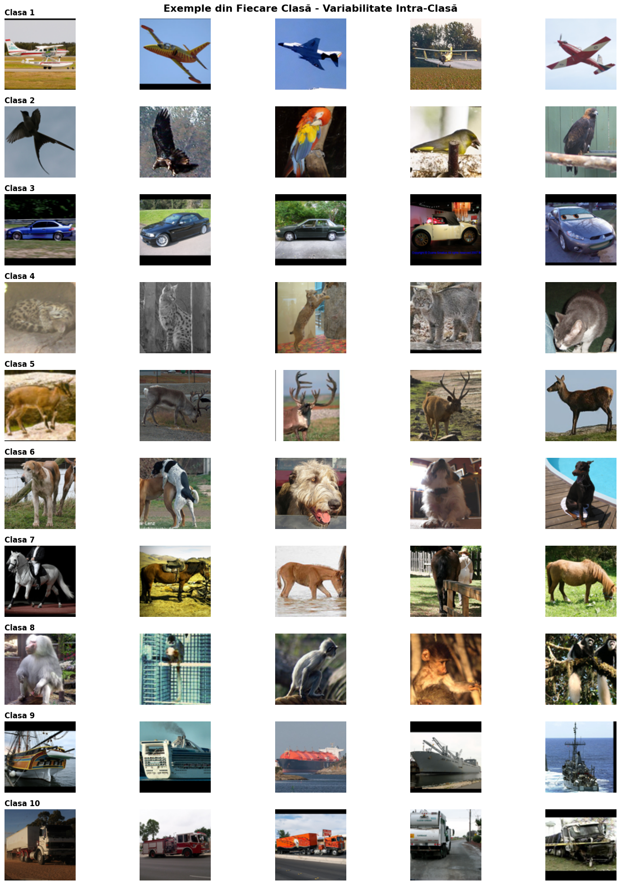

Exemplele de mai sus arată direct sursa acestei variabilități: aceeași clasă poate conține poziții, unghiuri, fundaluri și culori foarte diferite (de exemplu clasa "cal" include atât un cal alb dresat, cât și un ponei în iarbă).

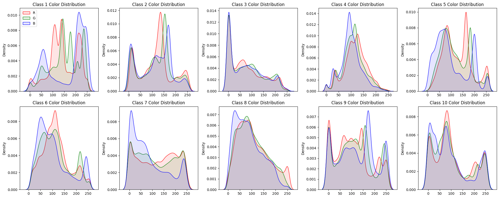

Analiza de corelație intra-clasă vs. inter-clasă (disponibilă direct în `imagebits.ipynb`) a arătat un scor de separabilitate pozitiv, dar mic: imaginile din aceeași clasă sunt doar puțin mai similare între ele decât cele din clase diferite. Practic, e o problemă de clasificare dificilă pentru un model simplu.

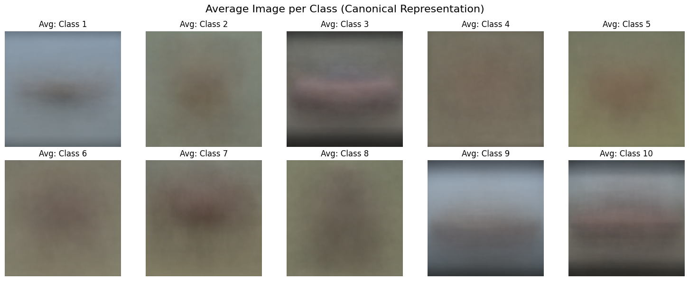

Imaginile medii per clasă sunt estompate pentru majoritatea claselor, semn de variabilitate mare de poziție și conținut. Excepție fac câteva clase (navă, camion), la care media păstrează un contur mai clar: compoziția cadrului e probabil mai constantă la acestea.

### Preprocesare și augmentare

Din cauza volumului mic de date, s-au aplicat **două straturi de augmentare**, cu roluri diferite:

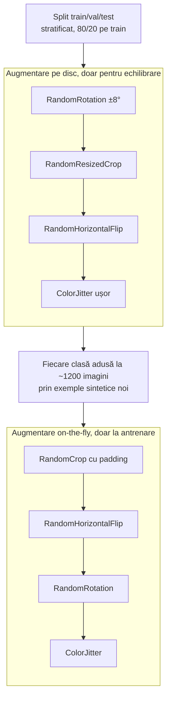

Primul strat generează exemple noi pe disc, aplicate **numai după** separarea train/validare/test, tocmai pentru a evita data leakage (dacă imagini foarte similare ajung și în antrenare și în validare, acuratețea pe validare devine bună într-un mod artificial). Al doilea strat e augmentare dinamică, aplicată la fiecare epocă direct în `DataLoader`, cu scopul de a generaliza modelul cu detaliile mixte ale imaginilor.

**De ce aceste transformări.** Stratul de generare sintetică produce imagini care rămân pe disc ca exemple permanente, deci transformările trebuie să arate ca poze plauzibile, nu doar variații agresive de antrenare:
- `RandomRotation ±8°`: robustețe la unghiuri de fotografiere ușor diferite, fără a distorsiona obiectul (o rotație mare ar strica ințelesul general al imaginilor, de exemplu o mașină cu roțile în sus).
- `RandomResizedCrop`: simulează variații de scală și încadrare, utile pentru ca modelul să recunoască obiectul indiferent cât de aproape sau departe apare în cadru.
- `RandomHorizontalFlip`: majoritatea claselor (mașină, animal, avion) pot fi oglindite, deci oferă invarianță la orientare.
- `ColorJitter` ușor: simulează condiții de iluminare diferite, pentru robustețe la lumină fără a schimba identitatea obiectului.

Stratul on-the-fly nu trebuie să producă o poză nouă, doar să miște ușor imaginea existentă la fiecare epocă:
- `RandomCrop` cu padding: simulează mici deplasări ale obiectului în cadru, iar padding-ul completează marginile ca să nu se piardă conținut la tăiere.
- `RandomHorizontalFlip` și `RandomRotation`: aceleași beneficii de invarianță ca mai sus, dar aplicate dinamic, astfel încât modelul nu vede niciodată exact aceeași imagine de două ori, ceea ce reduce memorarea (overfitting).
- `ColorJitter`: robustețe suplimentară la iluminare, aplicată constant pe tot parcursul antrenării.

### Arhitecturi

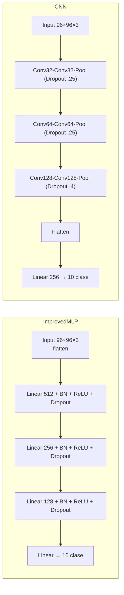

Ambele modele sunt antrenate în ansambluri de câte 5, cu configurații ușor diferite de learning rate și weight decay (AdamW, `CosineAnnealingLR`, early stopping la 7 epoci fără progres, `CrossEntropyLoss` cu label smoothing 0.1).

**De ce `CosineAnnealingLR`.** Rata de învățare scade lin, pe o curbă cosinus, de la valoarea maximă spre (1e-6), fără salturile bruște ale unei scăderi în trepte. Practic, pașii de optimizare sunt mari la început, când modelul are cel mai mult de învățat, și tot mai mici spre final, când e nevoie de rafinare fină în jurul unui minim.

**De ce label smoothing (0.1).** Fără el, `CrossEntropyLoss` împinge modelul să prezică o probabilitate cât mai apropiată de 100% pentru clasa corectă, ceea ce duce la un model încrezător și prost calibrat, predispus la overfitting. 

Label smoothing înlocuiește eticheta one-hot cu un amestec între eticheta reală și o distribuție uniformă pe toate clasele. Beneficiul contează în mod special aici, unde volumul mic de date reale și exemplele sintetice adăugate cresc riscul de overfitting.

### Ensembling

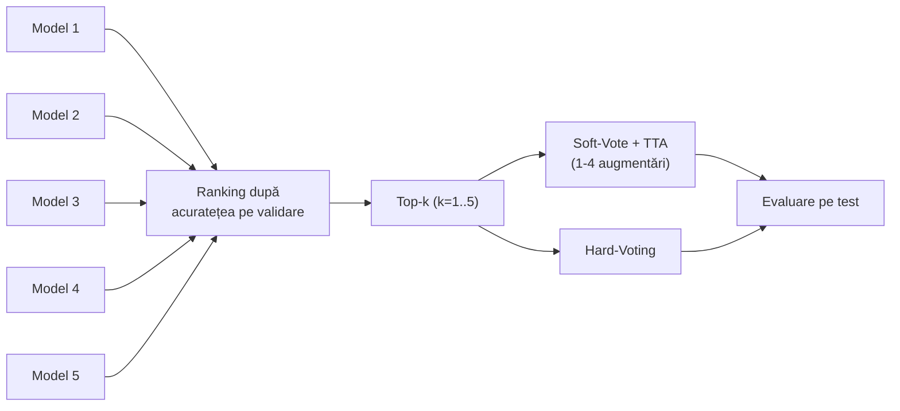

Pentru fiecare combinație (MLP/CNN × cu/fără augmentare) s-au testat toate combinațiile  de la Top-1 la Top-5, cu Soft-Vote+TTA (1-4 augmentări: aceeasi imagine, flip orizontal, flip vertical, rotație 90°) și Hard-Voting.

**De ce Test-Time Augmentation.** La evaluare, fiecare imagine de test trece prin model în mai multe variante (identitate, flip orizontal, flip vertical, rotație 90°), iar probabilitățile softmax rezultate sunt mediate înainte de decizia finală. 

E o tehnică fără cost de antrenare: modelele rămân aceleași, doar inferența rulează pe fiecare imagine. Motivul principal e robustețea: o predicție pe o singură versiune a imaginii poate fi greșită din întâmplare (de exemplu modelul poate fi mai sigur pe varianta oglindită decât pe cea originală), iar media peste mai multe variante reduce acest risc și scade șansa unei predicții greșite, dar încrezătoare.

### Rezultate

| Model | Augmentare | Cel mai bun ansamblu | Acuratețe | F1 |
|---|---|---|---|---|
| CNN | Da | Top-2, Soft-Vote TTA-2 | **80.06%** | 79.92% |
| CNN | Nu | Top-3, Soft-Vote TTA-2 | 77.30% | 77.20% |
| MLP | Da | Top-3, Soft-Vote TTA-1 | 52.56% | 51.93% |
| MLP | Nu | Top-5, Soft-Vote TTA-2 | 48.90% | 48.95% |

CNN depășește constant MLP cu 25-30 procente, iar augmentarea aduce un câștig pentru ambele arhitecturi. Principala limitare rămâne, dimensiunea și complexitatea vizuală a datelor, nu strategia de augmentare.

<table><tr>
<td>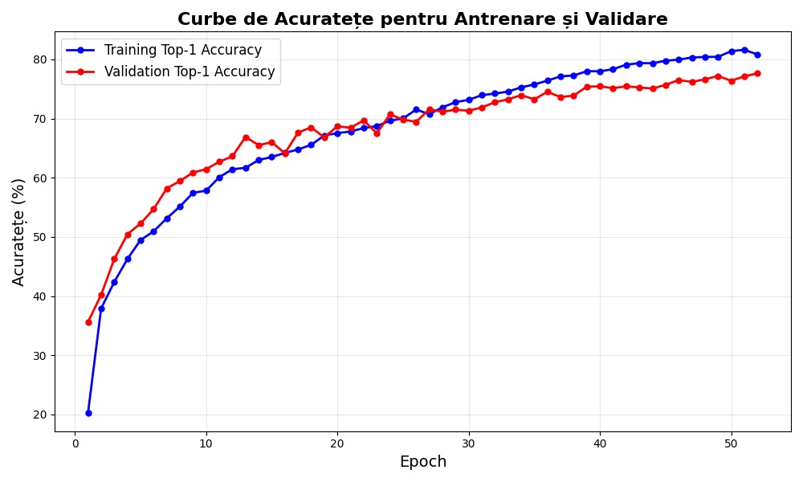</td>
<td>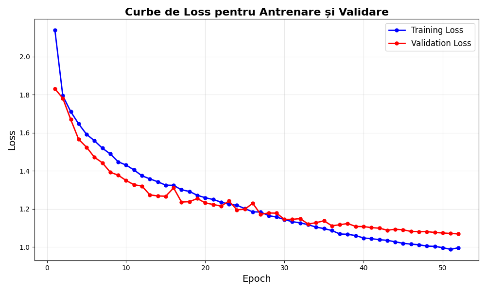</td>
</tr></table>

Curbele de mai sus (model individual CNN, cu augmentare, 77.6% acuratețe pe validare) arată o convergență stabilă, fără semne severe de overfitting: decalajul dintre antrenare și validare rămâne moderat pe tot parcursul.

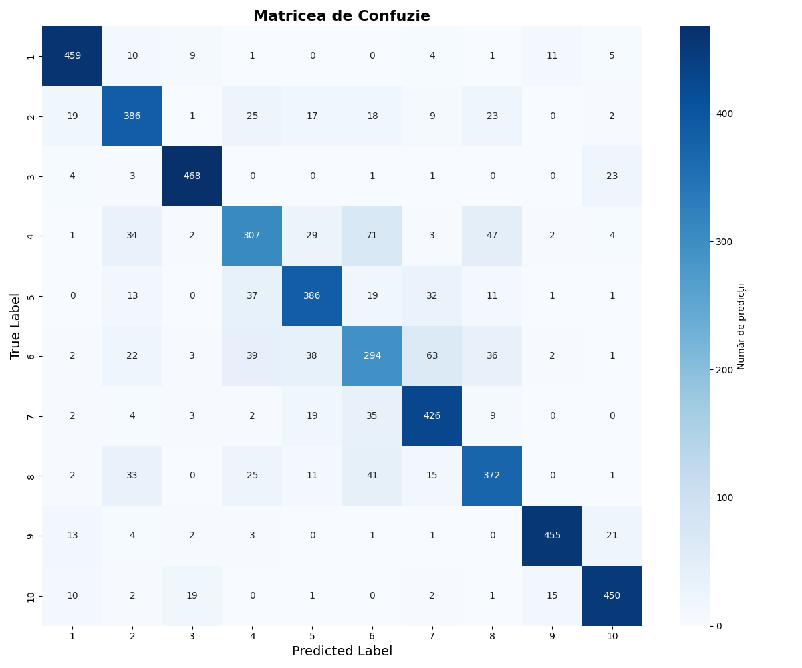

Matricea de confuzie a celui mai bun ansamblu arată o diagonală puternică pentru majoritatea claselor, cu confuzii concentrate mai ales între clase vizual apropiate (de exemplu pisică/câine, sau clasele de vehicule între ele).

---

## Capitolul 2: LandPatches

### Setul de date

10 clase de teren observat din satelit (AnnualCrop, Forest, HerbaceousVegetation, Highway, Industrial, Pasture, PermanentCrop, Residential, River, SeaLake), imagini RGB de 64×64 pixeli, cu split train/validare/test deja predefinit. Spre deosebire de Imagebits, aici nu a mai fost nevoie de generare sintetică de date pentru echilibrare.

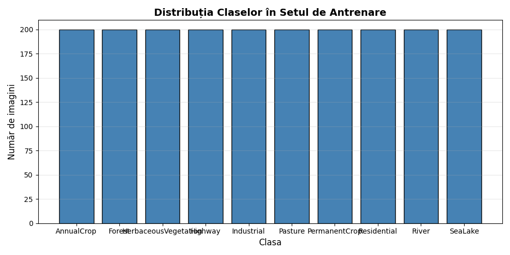

Ca și la Imagebits, dataset-ul este echilibrat per clasă, dar raportul dintre testare și antrenare+validare este mult mai mare aici, iar estimarea de test devine mai stabilă.

### Analiza exploratorie

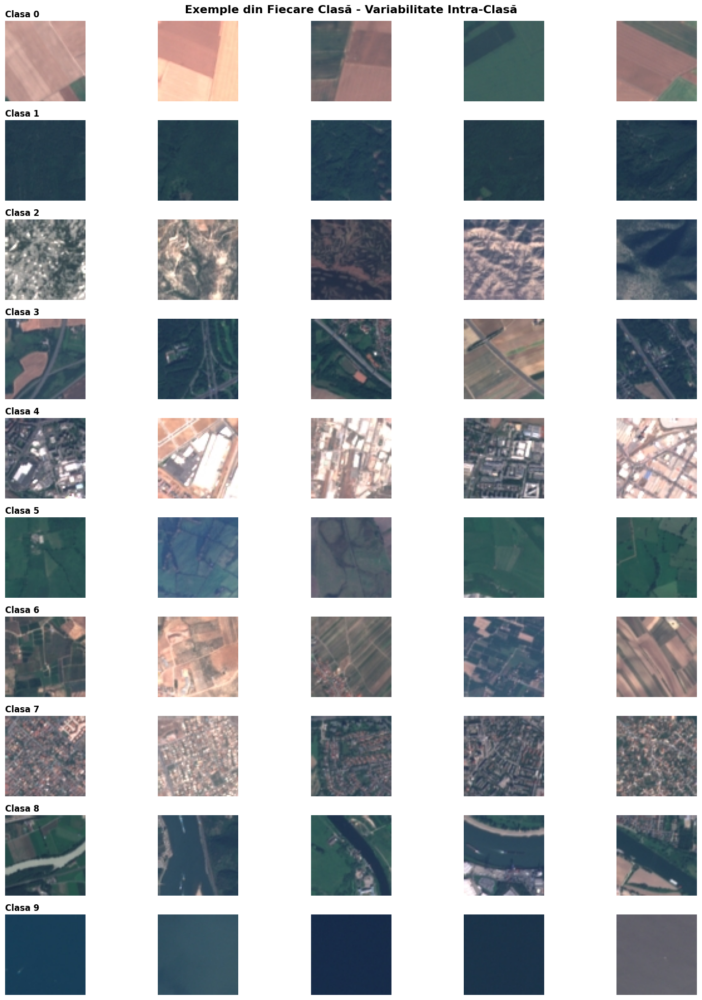

Fiind imagini satelitare, variabilitatea vizuală e de altă natură decât la Imagebits. Nu ține de poziția unui obiect în cadru, ci de textură și structură: un câmp arabil (AnnualCrop) și o pădure (Forest) diferă prin regularitate și granulație, nu prin formă.

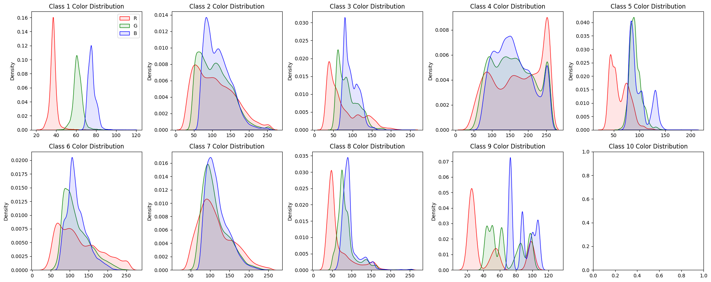

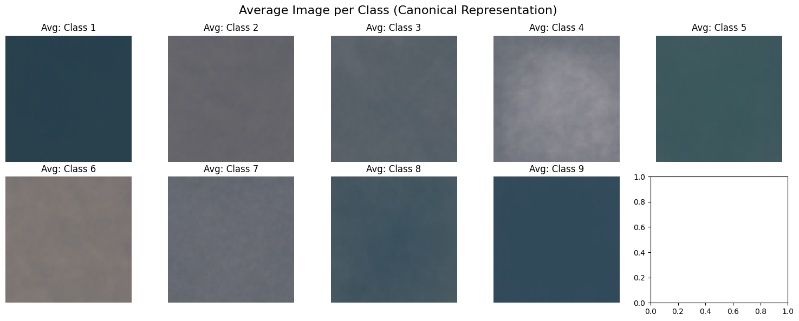

Spre deosebire de Imagebits, imaginile medii per clasă păstrează aici un caracter cromatic mult mai omogen (de exemplu River și SeaLake rămân predominant albăstrui-verzui în medie). Peisajele din satelit au o textură repetitivă, spre deosebire de varietatea de forme și unghiuri din fotografiile de obiecte.

### Preprocesare și augmentare

Nefiind nevoie de echilibrare, s-a aplicat un singur strat de augmentare, on-the-fly, mai simplu decât la Imagebits: `RandomRotation(10°)`, `RandomHorizontalFlip`, `RandomVerticalFlip`. S-a renunțat și la label smoothing (`CrossEntropyLoss` standard), iar numărul de epoci a fost mărit de la 60 la 80 și răbdarea early stopping de la 7 la 9. Antrenarea e mai lentă, dar modelul ajunge mai greu la overfitting pe acest set de date.

### Arhitecturi

Aceleași arhitecturi ca la Imagebits (`ImprovedMLP` 512-256-128 și `CNN` cu trei blocuri Conv-Conv-Pool), adaptate la dimensiunea de intrare de 64×64 și cu dropout ușor redus pentru MLP.

### Ensembling

Aceeași procedură Top-k + Soft-Vote/TTA + Hard-Voting descrisă la Imagebits, aplicată aici cu `ensemble_configs` diferite (learning rate mai mare, 3e-3, potrivit pentru un număr mai mare de epoci).

### Rezultate

| Model | Augmentare | Cel mai bun ansamblu | Acuratețe | F1 |
|---|---|---|---|---|
| CNN | Nu | Top-3, Soft-Vote TTA-2 | **81.90%** | 81.53% |
| CNN | Da | Top-1, Soft-Vote TTA-4 | 80.96% | 80.63% |
| MLP | Da | Top-3, Soft-Vote TTA-4 | 65.60% | 64.60% |
| MLP | Nu | Top-5, Soft-Vote TTA-4 | 60.34% | 61.19% |

<table><tr>
<td>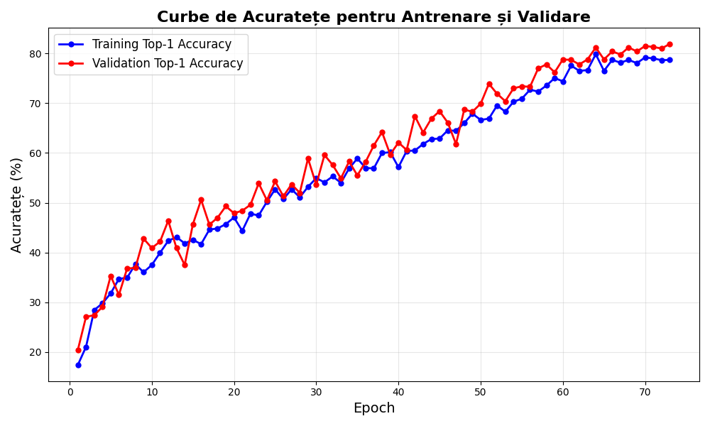</td>
<td>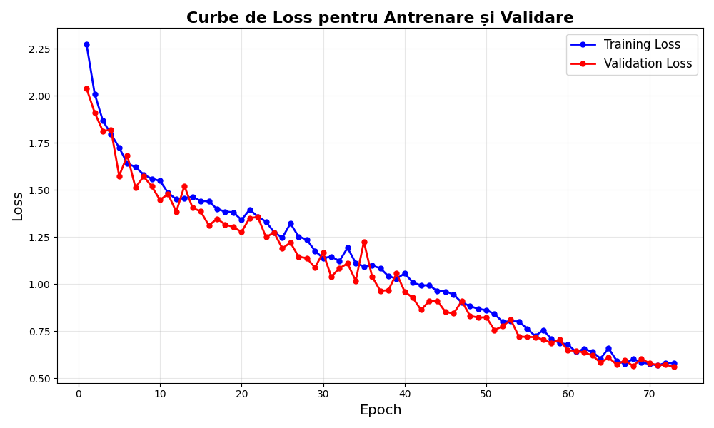</td>
</tr></table>

Modelul de mai sus (CNN, cu augmentare, modelul individual cu cea mai bună acuratețe din tot capitolul, 81.9% pe validare) arată o convergență lentă, dar constantă pe cele 80 de epoci, fără oscilații mari.

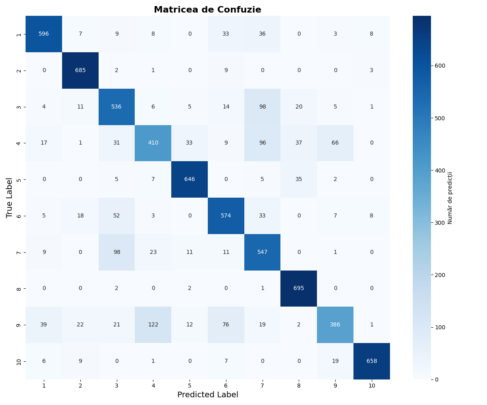

Confuziile principale ale ansamblului apar între clase cu textură similară din satelit, de exemplu HerbaceousVegetation și PermanentCrop, sau Highway și River: forma lungă și îngustă a acestora din urmă poate induce modelul în eroare.

### Observații și limitări

Un rezultat care nu apare în rezultatele finale, dar e vizibil în `land_patches/results/land_patches_model_accuracies_summary.csv`: **3 din cele 5 modele CNN antrenate (atât cu, cât și fără augmentare) au colapsat la ~10% acuratețe** (nivelul de șansă pentru 10 clase) încă din prima epocă, în timp ce celelalte modele CNN din același ansamblu au ajuns la 78-82%. Curba de acuratețe a unui astfel de model rămâne plată la un singur punct, semn de divergență imediată, nu de antrenare eșuată treptat. Cauza cea mai probabilă este learning rate-ul de 3e-3, ales pentru a compensa numărul mai mare de epoci, dar prea agresiv pentru inițializarea CNN pe acest set de date. MLP, cu aceeași configurație, nu a avut aceeași problemă. Modulul de selecție Top-k elimină automat modelele eșuate din ansamblu (sunt clasate ultimele după acuratețea pe validare), așa că rezultatul final de ansamblu nu e afectat. Rata de eșec de 60% pe arhitectura CNN arată totuși clar că rata de învățare ar trebui redusă sau însoțită de warm-up la o rulare viitoare.

---

## Concluzii comparative

- **CNN a fost superior MLP-ului pe ambele seturi de date**, cu o marjă de 25-30 puncte procentuale: arhitectura convoluțională exploatează structura spațială a imaginilor, pe când MLP-ul tratează fiecare pixel independent după flatten.
- **Augmentarea a ajutat mai mult la Imagebits**, pentru care adresa direct problema volumului mic de date, **decât la LandPatches**, unde dataset-ul era deja suficient de mare. La CNN pe LandPatches, augmentarea nu a adus practic niciun câștig față de varianta fără augmentare (80.96% vs. 81.90%).
- **Ensembling-ul cu Soft-Vote și TTA a fost constant metoda câștigătoare** față de Hard-Voting, în ambele capitole: probabilitățile medii softmax păstrează mai multă informație decât un simplu vot majoritar.
- Cele mai mari provocări au fost diferite pe cele două seturi de date: la Imagebits, variabilitatea intra-clasă a fotografiilor; la LandPatches, instabilitatea antrenării CNN la learning rate ridicat.

## Structura repository-ului

```
imagebits/
  train/, test/          (datele brute, nu sunt urcate în git, vezi .gitignore)
  results/
    eda/                 (distribuție, exemple, RGB, imagine medie)
    CNN_Aug/, CNN_NoAug/, MLP_Aug/, MLP_NoAug/
      training_curves/   (curbe acuratețe/loss per model individual)
      confusion_matrices/ (matrici de confuzie per configurație de ansamblu)
    ensemble_results_summary.csv
    model_accuracies_summary.csv

land_patches/
  train/, test/, val/     (datele brute, nu sunt urcate în git)
  results/                (aceeași structură ca mai sus, plus dataset_distribution/)

imagebits.ipynb           (notebook complet, cu toate output-urile)
land_patches.ipynb        (notebook complet, cu toate output-urile)
tema2_denis_hatu_raport.pdf (raportul inițial al temei)
```
