# Recunoaștere de imagini și analiză de sentiment

Acest proiect acoperă a doua temă de la Învățare Automată și tratează trei probleme de clasificare, rezolvate cu rețele neuronale antrenate de la zero. Primele două sunt probleme de clasificare a imaginilor și urmează același pipeline de bază: analiză exploratorie a datelor (EDA), augmentare, antrenare a unui ansamblu de modele MLP și CNN, apoi combinarea lor prin ensembling cu Test-Time Augmentation (TTA) și hard voting. A treia adaptează aceeași tematică generală (EDA, preprocesare) la text: RNN și LSTM în loc de MLP și CNN, antrenate direct ca modele individuale, fără ensembling.

- **Capitolul 1** descrie setul de date **Imagebits** (10 clase de obiecte, imagini 96×96).
- **Capitolul 2** descrie setul de date **LandPatches** (10 clase de teren, imagini de satelit, 64×64).
- **Capitolul 3** descrie analiza de sentiment pe recenzii în limba română (clasificare binară pozitiv/negativ).

Cele două seturi de date de imagini au pornit de la premise diferite: Imagebits venea cu un dezavantaj pentru modele: clasele nu erau balansate, iar LandPatches avea deja o împărțire train/val/test echilibrată. Asta a dus la decizii diferite de preprocesare, deși arhitecturile și logica de antrenare au rămas identice. Rezultatele complete se găsesc în `imagebits/results/ensemble_results_summary.csv` și `land_patches/results/land_patches_ensemble_results_summary.csv`; imaginile din acest README sunt doar o selecție reprezentativă din folderele `imagebits/results/` și `land_patches/results/`, unde se află toate graficele generate. Capitolul 3 tratează o problemă diferită ca natură a datelor (text, nu imagini) și e documentat separat mai jos, cu propriul pipeline.

## Pipeline-ul general

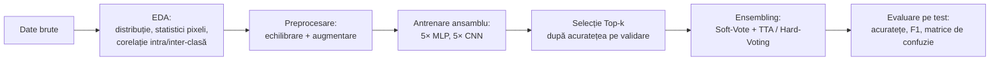

Ambele notebook-uri (`imagebits.ipynb`, `land_patches.ipynb`) sunt construite pe același schelet: o clasă de configurare cu hiperparametrii, funcții de EDA, două arhitecturi (`ImprovedMLP` și `CNN`), o buclă de antrenare cu early stopping, și un modul de ensembling cu patru variante de TTA (fără augmentare, flip orizontal, flip vertical, rotație 90°) plus hard voting.

---

## Capitolul 1: Imagebits

### Setul de date

10 clase de obiecte (avion, pasăre, mașină, pisică, cerb, câine, cal, maimuță, navă, camion), imagini RGB de 96×96 pixeli. Problema inițială: setul de antrenare avea prea puține exemple per clasă comparativ cu testarea, ceea ce a motivat generarea de date sintetice.

Distribuția e echilibrată per clasă (aproximativ 800 de imagini fiecare), dar volumul total rămâne mic pentru o rețea antrenată de la zero.

### Analiza exploratorie

Statisticile de pixeli per clasă arată medii între ~90 și ~135 și deviații standard de 60-76, semn că iluminarea și conținutul variază mult chiar în interiorul aceleiași clase. Distribuțiile de culoare RGB confirmă acest lucru: aproape toate clasele au histograme multimodale, adică imaginile conțin regiuni cu niveluri de culoare diferite (zone luminoase, umbre, fundal).


Exemplele de mai sus arată direct sursa acestei variabilități: aceeași clasă poate conține poziții, unghiuri, fundaluri și culori foarte diferite (de exemplu clasa "cal" include atât un cal alb dresat, cât și un ponei în iarbă).


Analiza de corelație intra-clasă vs. inter-clasă (disponibilă direct în `imagebits.ipynb`) a arătat un scor de separabilitate pozitiv, dar mic: imaginile din aceeași clasă sunt doar puțin mai similare între ele decât cele din clase diferite. Practic, e o problemă de clasificare dificilă pentru un model simplu.


Imaginile medii per clasă sunt estompate pentru majoritatea claselor, semn de variabilitate mare de poziție și conținut. Excepție fac câteva clase (navă, camion), la care media păstrează un contur mai clar: compoziția cadrului e probabil mai constantă la acestea.

### Preprocesare și augmentare

Din cauza volumului mic de date, s-au aplicat **două straturi de augmentare**, cu roluri diferite:

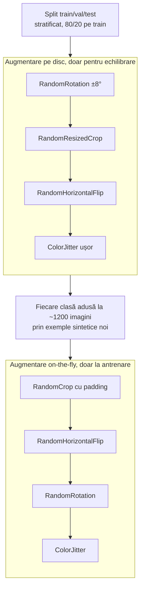

Primul strat generează exemple noi pe disc, aplicate **numai după** separarea train/validare/test, tocmai pentru a evita data leakage (dacă imagini foarte similare ajung și în antrenare și în validare, acuratețea pe validare devine bună într-un mod artificial). Al doilea strat e augmentare dinamică, aplicată la fiecare epocă direct în `DataLoader`, cu scopul de a generaliza modelul cu detaliile mixte ale imaginilor.

**De ce aceste transformări.** Stratul de generare sintetică produce imagini care rămân pe disc ca exemple permanente, deci transformările trebuie să arate ca poze plauzibile, nu doar variații agresive de antrenare:
- `RandomRotation ±8°`: robustețe la unghiuri de fotografiere ușor diferite, fără a distorsiona obiectul (o rotație mare ar strica ințelesul general al imaginilor, de exemplu o mașină cu roțile în sus).
- `RandomResizedCrop`: simulează variații de scală și încadrare, utile pentru ca modelul să recunoască obiectul indiferent cât de aproape sau departe apare în cadru.
- `RandomHorizontalFlip`: majoritatea claselor (mașină, animal, avion) pot fi oglindite, deci oferă invarianță la orientare.
- `ColorJitter` ușor: simulează condiții de iluminare diferite, pentru robustețe la lumină fără a schimba identitatea obiectului.

Stratul on-the-fly nu trebuie să producă o poză nouă, doar să miște ușor imaginea existentă la fiecare epocă:
- `RandomCrop` cu padding: simulează mici deplasări ale obiectului în cadru, iar padding-ul completează marginile ca să nu se piardă conținut la tăiere.
- `RandomHorizontalFlip` și `RandomRotation`: aceleași beneficii de invarianță ca mai sus, dar aplicate dinamic, astfel încât modelul nu vede niciodată exact aceeași imagine de două ori, ceea ce reduce memorarea (overfitting).
- `ColorJitter`: robustețe suplimentară la iluminare, aplicată constant pe tot parcursul antrenării.

### Arhitecturi

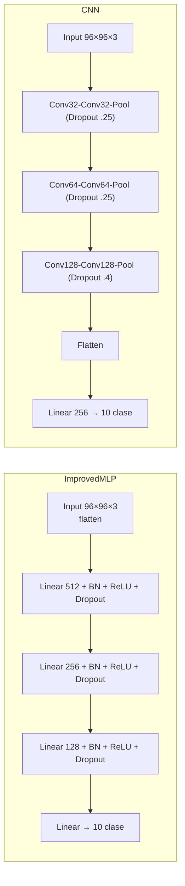

Ambele modele sunt antrenate în ansambluri de câte 5, cu configurații ușor diferite de learning rate și weight decay (AdamW, `CosineAnnealingLR`, early stopping la 7 epoci fără progres, `CrossEntropyLoss` cu label smoothing 0.1).

**De ce `CosineAnnealingLR`.** Rata de învățare scade lin, pe o curbă cosinus, de la valoarea maximă spre (1e-6), fără salturile bruște ale unei scăderi în trepte. Practic, pașii de optimizare sunt mari la început, când modelul are cel mai mult de învățat, și tot mai mici spre final, când e nevoie de rafinare fină în jurul unui minim.

**De ce label smoothing (0.1).** Fără el, `CrossEntropyLoss` împinge modelul să prezică o probabilitate cât mai apropiată de 100% pentru clasa corectă, ceea ce duce la un model încrezător și prost calibrat, predispus la overfitting. 

Label smoothing înlocuiește eticheta one-hot cu un amestec între eticheta reală și o distribuție uniformă pe toate clasele. Beneficiul contează în mod special aici, unde volumul mic de date reale și exemplele sintetice adăugate cresc riscul de overfitting.

### Ensembling

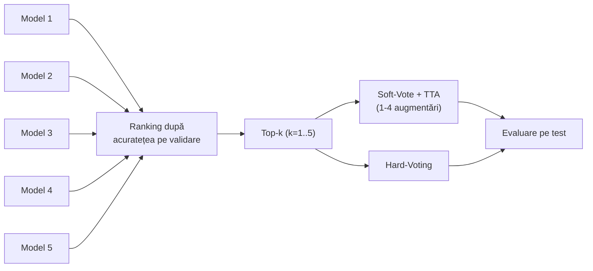

Pentru fiecare combinație (MLP/CNN × cu/fără augmentare) s-au testat toate combinațiile de la Top-1 la Top-5, cu Soft-Vote+TTA (1-4 augmentări: aceeași imagine, flip orizontal, flip vertical, rotație 90°) și Hard-Voting.

**De ce Test-Time Augmentation.** La evaluare, fiecare imagine de test trece prin model în mai multe variante (identitate, flip orizontal, flip vertical, rotație 90°), iar probabilitățile softmax rezultate sunt mediate înainte de decizia finală. 

E o tehnică fără cost de antrenare: modelele rămân aceleași, doar inferența rulează pe fiecare imagine. Motivul principal e robustețea: o predicție pe o singură versiune a imaginii poate fi greșită din întâmplare (de exemplu modelul poate fi mai sigur pe varianta oglindită decât pe cea originală), iar media peste mai multe variante reduce acest risc și scade șansa unei predicții greșite, dar încrezătoare.

### Rezultate

| Model | Augmentare | Cel mai bun ansamblu | Acuratețe | F1 |
|---|---|---|---|---|
| CNN | Da | Top-2, Soft-Vote TTA-2 | **80.06%** | 79.92% |
| CNN | Nu | Top-3, Soft-Vote TTA-2 | 77.30% | 77.20% |
| MLP | Da | Top-3, Soft-Vote TTA-1 | 52.56% | 51.93% |
| MLP | Nu | Top-5, Soft-Vote TTA-2 | 48.90% | 48.95% |

CNN depășește constant MLP cu 25-30 procente, iar augmentarea aduce un câștig pentru ambele arhitecturi. Principala limitare rămâne dimensiunea și complexitatea vizuală a datelor, nu strategia de augmentare.

<table><tr>
<td></td>
<td></td>
</tr></table>

Curbele de mai sus (model individual CNN, cu augmentare, 77.6% acuratețe pe validare) arată o convergență stabilă, fără semne severe de overfitting: decalajul dintre antrenare și validare rămâne moderat pe tot parcursul.


Matricea de confuzie a celui mai bun ansamblu arată o diagonală puternică pentru majoritatea claselor, cu confuzii concentrate mai ales între clase vizual apropiate (de exemplu pisică/câine, sau clasele de vehicule între ele).

---

## Capitolul 2: LandPatches

### Setul de date

10 clase de teren observat din satelit (AnnualCrop, Forest, HerbaceousVegetation, Highway, Industrial, Pasture, PermanentCrop, Residential, River, SeaLake), imagini RGB de 64×64 pixeli, cu split train/validare/test deja predefinit. Spre deosebire de Imagebits, aici nu a mai fost nevoie de generare sintetică de date pentru echilibrare.


Ca și la Imagebits, dataset-ul este echilibrat per clasă, dar raportul dintre testare și antrenare+validare este mult mai mare aici, iar estimarea de test devine mai stabilă. Setul de date fusese deja împărțit.

### Analiza exploratorie


Fiind imagini satelitare, variabilitatea vizuală e de altă natură decât la Imagebits. Nu ține de poziția unui obiect în cadru, ci de textură și structură: un câmp arabil (AnnualCrop) și o pădure (Forest) diferă prin regularitate și granulație, nu prin formă.


Spre deosebire de Imagebits, imaginile medii per clasă păstrează cromatică omogenă (de exemplu River și SeaLake rămân predominant albăstrui-verzui în medie). Peisajele din satelit au o textură repetitivă, spre deosebire de varietatea de forme și unghiuri din fotografiile de obiecte/vietăți.

### Preprocesare și augmentare

Nefiind nevoie de echilibrare a setului de date (train/val/test veneau deja separate și echilibrate), s-a renunțat la stratul de generare sintetică pe disc folosit la Imagebits. A rămas un singur strat de augmentare, on-the-fly, aplicat direct în `DataLoader`: `RandomRotation(10°)`, `RandomHorizontalFlip(p=0.4)`, `RandomVerticalFlip(p=0.4)`.

**De ce aceste transformări.** Spre deosebire de Imagebits, unde obiectele au o orientare naturală (un cal stă pe picioare, o mașină stă pe roți), imaginile satelitare sunt privite direct de sus, fără o orientare canonică:
- `RandomRotation(10°)`: rotația nu riscă să strice sensul imaginii, pentru că un câmp sau o pădure rămân la fel de plauzibile la orice unghi, fără un "sus" corect.
- `RandomHorizontalFlip` și `RandomVerticalFlip` (ambele cu probabilitate 0.4): la o imagine văzută de sus, oglindirea pe oricare axă produce tot o imagine plauzibilă a aceleiași clase de teren. La Imagebits, un flip vertical ar fi întors obiectele cu susul în jos și le-ar fi făcut nerealiste, de-asta a fost evitat acolo; aici, absența unei orientări fixe face flip-ul vertical la fel de sigur ca cel orizontal.

**De ce nu s-au mai folosit `ColorJitter` sau `RandomCrop`/`RandomResizedCrop`.** La Imagebits, clasele se disting mai ales prin formă și contur (pisică vs. câine), deci variațiile de iluminare sau încadrare ajutau modelul să ignore detalii nerelevante. La LandPatches, clasele sunt definite în bună parte de culoare și textură (River/SeaLake albăstrui, Forest verde-închis, AnnualCrop verde-gălbui uniform, vezi imaginile medii per clasă de mai sus), iar a distorsiona artificial culoarea ar risca să șteargă tocmai semnalul care separă clasele. La fel, patch-urile de teren sunt relativ omogene pe toată suprafața, fără un obiect central de recadrat, deci un crop aleator ar aduce mai puțin beneficiu decât la Imagebits, unde simula translația unui obiect în cadrul unei scene mai largi.

**De ce fără label smoothing.** La Imagebits, `label_smoothing=0.1` compensa riscul adus de exemplele sintetice generate pe disc, uneori aproape identice între ele, care puteau face modelul excesiv de încrezător. Aici nu există augmentare pe disc, iar granițele dintre clasele vizual apropiate (HerbaceousVegetation vs. PermanentCrop, Highway vs. River) sunt oricum estompate de conținutul real al imaginilor, fără ajutorul unor duplicate sintetice; s-a preferat `CrossEntropyLoss` simplu, ca modelul să poată învăța granițe de decizie cât mai clare acolo unde diferența reală dintre clase e mică.

**De ce mai multe epoci (80 vs. 60) și patience mai mare la early stopping (9 vs. 7).** Augmentarea on-the-fly de aici e mai simplă (3 transformări, fără `ColorJitter`/crop) decât cea de la Imagebits, deci fiecare epocă introduce mai puțină varietate în datele văzute de model, iar convergența e mai lentă. O răbdare mai mare la early stopping evită oprirea prematură, mai frecventă atunci când augmentarea e mai blândă și progresul de la o epocă la alta e mai mic.

### Arhitecturi

Aceleași arhitecturi ca la Imagebits (`ImprovedMLP` 512-256-128 și `CNN` cu trei blocuri Conv-Conv-Pool), adaptate la dimensiunea de intrare de 64×64 și cu dropout ușor redus pentru MLP (0.2 vs. 0.35 la Imagebits, întrucât aici nu mai există riscul de overfitting pe exemple sintetice aproape duplicate).

### Ensembling

Aceeași procedură Top-k + Soft-Vote/TTA + Hard-Voting descrisă la Imagebits, aplicată aici cu `ensemble_configs` diferite: toate cele 5 modele pornesc de la `lr=3e-3` (față de 5e-4-7e-4 la Imagebits) și variază doar `weight_decay` între ele.

**De ce un learning rate mai mare.** `CosineAnnealingLR` scade rata de învățare lin, până aproape de zero, pe durata a `T_max=epochs`. Cu 80 de epoci (față de 60 la Imagebits), un punct de plecare la fel de mic ca acolo ar fi petrecut prea mult timp aproape de minimul curbei, fără progres real. Rata de 3e-3 lasă loc de scădere pe un orizont mai lung. Totuși, cum arată secțiunea de mai jos, s-a dovedit și prea agresivă pentru inițializarea CNN, care a colapsat în 3 din 5 rulări din ansamblu.

### Rezultate

| Model | Augmentare | Cel mai bun ansamblu | Acuratețe | F1 |
|---|---|---|---|---|
| CNN | Nu | Top-3, Soft-Vote TTA-2 | **81.90%** | 81.53% |
| CNN | Da | Top-1, Soft-Vote TTA-4 | 80.96% | 80.63% |
| MLP | Da | Top-3, Soft-Vote TTA-4 | 65.60% | 64.60% |
| MLP | Nu | Top-5, Soft-Vote TTA-4 | 60.34% | 61.19% |

<table><tr>
<td></td>
<td></td>
</tr></table>

Modelul de mai sus (CNN, cu augmentare, modelul individual cu cea mai bună acuratețe din tot capitolul, 81.9% pe validare) arată o convergență lentă, dar constantă pe cele 80 de epoci, fără oscilații mari.


Confuziile principale ale ansamblului apar între clase cu textură similară din satelit, de exemplu HerbaceousVegetation și PermanentCrop, sau Highway și River: forma lungă și îngustă a acestora din urmă poate induce modelul în eroare.

### Observații și limitări

Un rezultat care nu apare în rezultatele finale, dar e vizibil în `land_patches/results/land_patches_model_accuracies_summary.csv`: **3 din cele 5 modele CNN antrenate (atât cu, cât și fără augmentare) au colapsat la ~10% acuratețe** (nivelul de șansă pentru 10 clase) încă din prima epocă, în timp ce celelalte modele CNN din același ansamblu au ajuns la 78-82%. Curba de acuratețe a unui astfel de model rămâne plată la un singur punct, semn de divergență imediată, nu de antrenare eșuată treptat. 

Cauza cea mai probabilă este learning rate-ul de 3e-3, ales pentru a compensa numărul mai mare de epoci, dar prea agresiv pentru inițializarea CNN pe acest set de date. MLP, cu aceeași configurație, nu a avut aceeași problemă. 

Modulul de selecție Top-k elimină automat modelele eșuate din ansamblu (sunt clasate ultimele după acuratețea pe validare), așa că rezultatul final de ansamblu nu e afectat. Rata de eșec de 60% pe arhitectura CNN arată totuși clar că rata de învățare ar trebui redusă sau însoțită de warm-up la o rulare viitoare.

---

## Capitolul 3: Analiză de sentiment (text românesc)

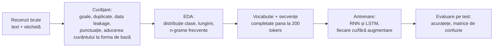

### Setul de date

17941 de recenzii în antrenare și 11005 în testare, etichetate binar (1 = pozitiv, 0 = negativ). 

Exemplele din date arată că setul amestecă cel puțin două domenii diferite de recenzii: filme (de exemplu un text despre un documentar pe tema atacurilor din 11 septembrie) și produse electrocasnice (o recenzie despre un frigider). Amestecul de domenii explică parțial de ce vocabularul e mai variat decât într-un set strict de recenzii de film.

### Curățare

Înainte de orice analiză, datele au trecut prin mai multe filtre succesive, în această ordine:
- **Valori goale**: 290 de rânduri eliminate din train, 0 din test.
- **Data leakage între train și test**: 56 de texte identice apăreau în ambele seturi; au fost eliminate din test, ca acuratețea de test să nu fie influențată artificial de exemple deja văzute la antrenare.
- **Duplicate aproape identice**: 1923 de rânduri din train și 322 din test aparțineau unor grupuri de texte identice după normalizare (litere mici, fără punctuație); s-a păstrat un singur exemplar din fiecare grup. Un grup avea etichete contradictorii (același text apărea de 4 ori: de 3 ori pozitiv, o dată negativ) și a fost rezolvat implicit prin păstrarea primei apariții, nu printr-un vot majoritar explicit.
- **Punctuație finală repetată**: analiza tiparelor de final de propoziție a arătat o proporție mare de punctuație informală ("...", "!!!", ":)"), tipică recenziilor scrise de utilizatori; secvențele de punctuație repetată de la finalul textului au fost reduse la un singur caracter dominant.
- **Lematizare cu `spaCy` (`ro_core_news_sm`)**: fiecare text a fost adus la litere mici, apoi lematizat, cu eliminarea stopword-urilor, a punctuației și a numelor proprii (`PROPN`).

**De ce s-au eliminat numele proprii.** Un nume de actor, regizor sau marcă de produs poate apărea des într-o clasă doar din motive întâmplătoare, fără legătură reală cu sentimentul exprimat. Eliminarea lor forțează modelul să învețe din cuvinte cu sentiment (adjective, verbe, adverbe), nu din asocieri întâmplătoare cu nume proprii specifice.

După curățare, distribuția claselor a rămas moderat dezechilibrată: train are 9934 de exemple pozitive și 6536 negative (raport 1.52), iar test are 6057 pozitive și 4729 negative (raport 1.28). Dezechilibrul nu e suficient de mare încât să justifice o strategie explicită de echilibrare, ca la Imagebits.

### Analiza exploratorie

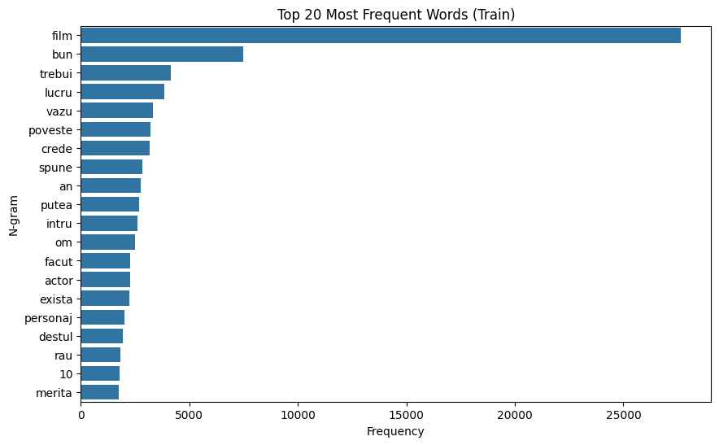

Cuvântul "film" domină vocabularul (aproximativ 27500 de apariții), urmat de "bun", "trebui", "lucru", "poveste", "actor", "personaj": o confirmare directă că majoritatea textelor sunt recenzii de film, nu de produse. 

Bigramele cele mai frecvente ("film bun", "efect special", "notă 10", "film merita") întăresc aceeași observație.

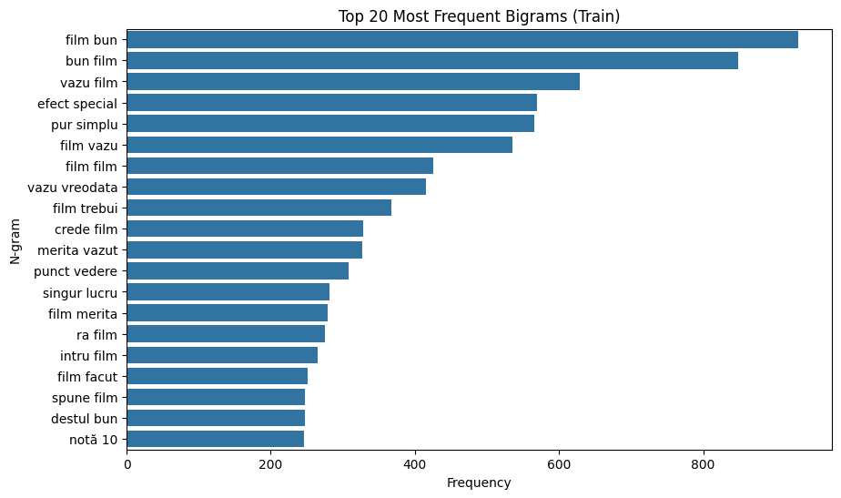

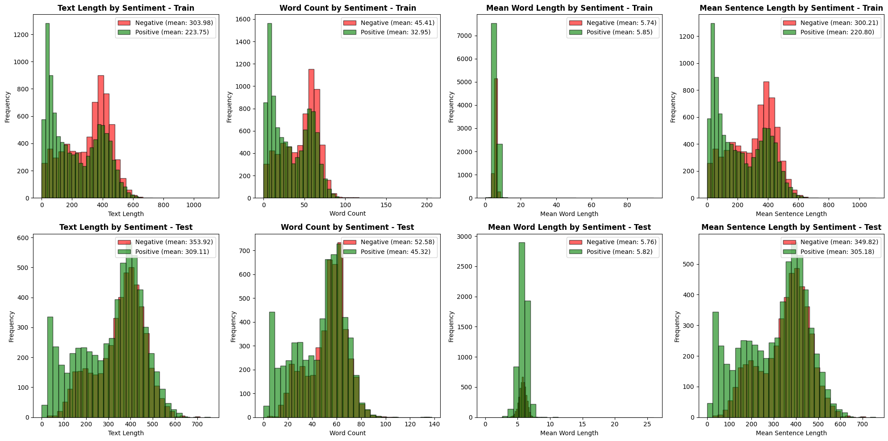

Recenziile negative sunt sistematic mai lungi decât cele pozitive: lungime medie de 304 caractere pentru negativ față de 224 pentru pozitiv în train (354 față de 309 în test), iar numărul mediu de cuvinte urmează același tipar (45 față de 33 în train). Practic, nemulțumirea are mai multă motivare scrisă decât aprecierea simplă, un semnal indirect de sentiment pe care modelul îl poate exploata chiar înainte de a ajunge la conținutul semantic propriu-zis al textului. Lungimea medie a cuvântului rămâne aproape identică între clase (5.7-5.9 caractere), semn că diferența nu vine din alegeri morfologice, ci din cât de mult scrie fiecare tip de recenzent.

### Preprocesare pentru model

Textele aduse la forma lor normală au fost transformate în secvențe de indici dintr-un vocabular construit din cuvintele cu frecvență minimă 2 în train: 22354 de cuvinte, plus tokenii `<PAD>` și `<UNK>`. Secvențele au fost completate sau trunchiate la 200 de tokeni; cum media reală e de 33-52 de cuvinte per recenzie, trunchierea afectează doar recenziile neobișnuit de lungi.

**De ce embeddings învățate de la zero, nu FastText.** Configurația avea prevăzută încărcarea unor vectori FastText pre-antrenați pentru română (`cc.ro.300.vec`), care ar fi oferit modelului o reprezentare semantică a cuvintelor încă de la inițializare. 

Fișierul nu era disponibil local, așa că stratul de embedding de 300 de dimensiuni a pornit de la inițializare aleatoare și a fost antrenat de la zero, odată cu restul rețelei (`freeze=False`). Practic, modelul trebuie să învețe simultan atât ce înseamnă fiecare cuvânt, cât și cum se leagă de sentiment.

### Arhitecturi

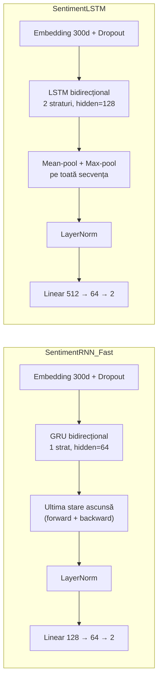

**De ce cele două arhitecturi agregă secvența diferit.** `SentimentRNN_Fast` folosește doar ultima stare ascunsă a GRU-ului (din ambele direcții), în timp ce `SentimentLSTM` combină mean-pooling și max-pooling peste toate cele 200 de poziții ale secvenței. Într-un text de până la 200 de cuvinte, semnalul relevant pentru sentiment poate apărea oriunde: o recenzie poate începe cu laude și se poate termina cu o critică dură, sau invers. 

Pooling-ul pe toată secvența dă LSTM-ului acces direct la acel semnal indiferent de poziție, în timp ce GRU-ul depinde de cât de bine reușește starea ascunsă finală să rețină informația de la începutul textului.

### Antrenare

Ambele arhitecturi sunt antrenate cu Adam (`lr=1e-4`, `weight_decay=5e-4`), `ReduceLROnPlateau` (factor 0.3, patience 2 epoci), early stopping cu patience 4 din maximum 20 de epoci, `CrossEntropyLoss` cu label smoothing 0.1 și gradient clipping la normă 1.0.

**Augmentare de text.** Fiecare arhitectură (RNN și LSTM) e antrenată de două ori: o dată pe setul de antrenare original, o dată pe setul de antrenare dublat cu o copie augmentată a fiecărui exemplu (`augment_text_data`: ștergere aleatoare de cuvinte cu probabilitate 0.1, interschimbare aleatoare a două cuvinte cu probabilitate 0.1). Augmentarea se aplică **doar** pe porțiunea de antrenare, după separarea train/validare, ca să nu apară variante ale aceluiași text și în validare și în antrenare.

**De ce `ReduceLROnPlateau` în loc de `CosineAnnealingLR`.** La Imagebits și LandPatches, numărul de epoci era fixat dinainte (60, respectiv 80), ceea ce face ca o curbă de scădere planificată pe tot orizontul de antrenare să aibă sens. 

Aici antrenarea se oprește devreme, ori de câte ori validarea nu mai progresează timp de 4 epoci, deci orizontul real e imprevizibil; un scheduler care reacționează la evoluția reală a loss-ului de validare se potrivește mai bine unei antrenări scurte și neregulate decât o curbă fixă legată de un număr de epoci care s-ar putea să nu fie niciodată atins.

**De ce o regularizare atât de puternică (dropout 0.6, weight decay, label smoothing, gradient clipping).** Consecință directă a embeddings-urilor învățate de la zero: cu un vocabular de peste 22000 de cuvinte și doar aproximativ 14000 de exemple de antrenare, riscul de overfitting e mare. Curbele de antrenare confirmă asta: acuratețea pe train ajunge la 89-90%, în timp ce validarea rămâne la 85%. Stack-ul de regularizare ține diferența sub control, dar nu este elimină complet.

<table><tr>
<td>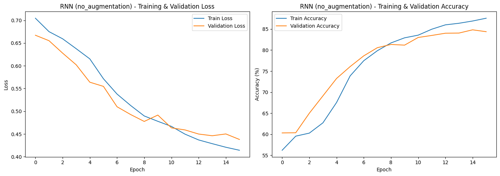</td>
<td>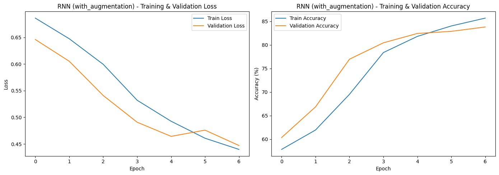</td>
</tr><tr>
<td>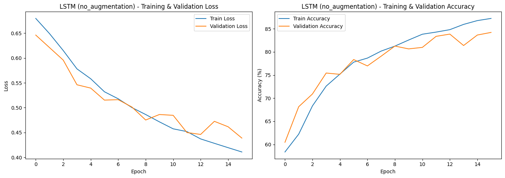</td>
<td>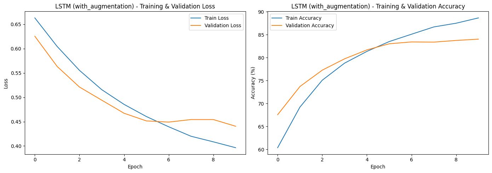</td>
</tr></table>

### Rezultate

Un ansamblu de 5 modele per arhitectură a fost testat inițial, dar nu a adus niciun câștig față de un singur model (vezi Concluzii comparative), așa că acest capitol antrenează câte un singur model RNN și LSTM, fiecare cu și fără augmentare de text, ca să se poată compara direct efectul augmentării:

| Model | Augmentare | Acuratețe pe test |
|---|---|---|
| RNN | fără | 83.58% |
| RNN | cu | 83.65% |
| LSTM | fără | 82.14% |
| LSTM | cu | **84.23%** |

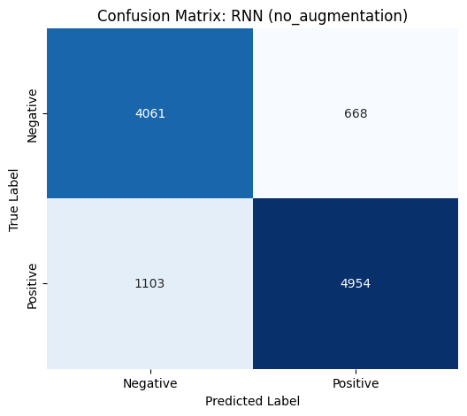

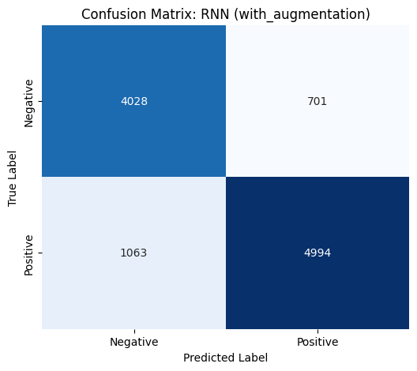

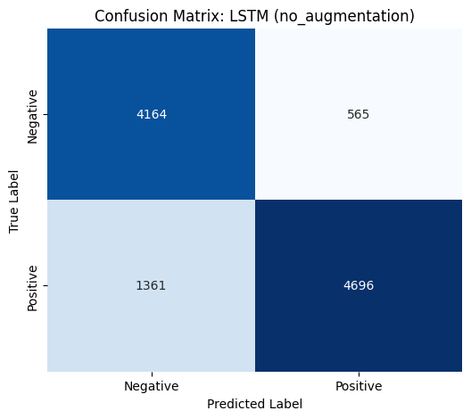

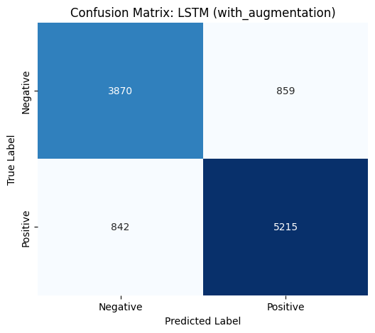
---

## Concluzii comparative

- **CNN a fost superior MLP-ului pe ambele seturi de date de imagini**, cu o marjă semnificativă: arhitectura convoluțională exploatează structura spațială a imaginilor, pe când MLP-ul tratează fiecare pixel independent după flatten.
- **Augmentarea a ajutat mai mult la Imagebits**, pentru care adresa direct problema volumului mic de date, **decât la LandPatches**, unde dataset-ul era deja suficient de mare. La CNN pe LandPatches, augmentarea nu a adus practic niciun câștig față de varianta fără augmentare (80.96% vs. 81.90%). La analiza de sentiment, augmentarea de text (ștergere și interschimbare aleatoare de cuvinte, aplicată doar pe porțiunea de antrenare) a adus un câștig neglijabil la RNN (83.58% → 83.65%), dar vizibil la LSTM (82.14% → 84.23%), care devine cel mai bun model al capitolului.
- **Ensembling-ul cu Soft-Vote a fost constant metoda câștigătoare** față de Hard-Voting la Imagebits și LandPatches, dar la analiza de sentiment nu a adus niciun câștig față de un singur model, pentru că modelele din ansamblu erau prea asemănătoare între ele; din acest motiv, capitolul de analiză de sentiment antrenează acum direct câte un singur model RNN și LSTM, fără ensembling.

## Structura repository-ului

```
imagebits/
  train/, test/          (datele brute, nu sunt urcate în git, vezi .gitignore)
  results/
    eda/                 (distribuție, exemple, RGB, imagine medie)
    CNN_Aug/, CNN_NoAug/, MLP_Aug/, MLP_NoAug/
      training_curves/   (curbe acuratețe/loss per model individual)
      confusion_matrices/ (matrici de confuzie per configurație de ansamblu)
    ensemble_results_summary.csv
    model_accuracies_summary.csv

land_patches/
  train/, test/, val/     (datele brute, nu sunt urcate în git)
  results/                (aceeași structură ca mai sus, plus dataset_distribution/)

sentiment_analysis/
  results/                (EDA și rezultate de model, toate în același folder:
                           distribuție clase, n-grame, lungimi, curbe de antrenare,
                           matrici de confuzie)

train_sentiment_analysis.csv, test_sentiment_analysis.csv (datele brute, la rădăcina proiectului)
imagebits.ipynb           (notebook complet, cu toate output-urile)
land_patches.ipynb        (notebook complet, cu toate output-urile)
sentiment_analysis_romanian_text.ipynb (notebook complet, cu toate output-urile)
tema2_denis_hatu_raport.pdf (raportul inițial al temei)
```
